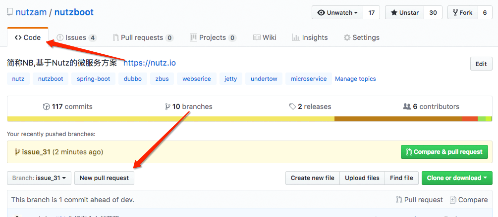
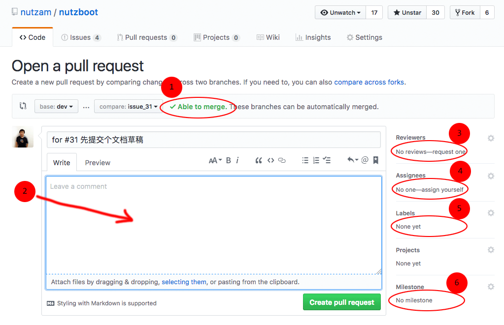

# 为什么要指定协同工作流程

与核心库 [Nutz](https://nutzam.com) 不同，NutzBoot 项目一开始就是多人参与的项目。为了能让项目顺利推进，必须有一套流程规范，才能让参与工作的人形成合力。

同时，NutzBoot 是开源项目，而且是 Nutz 这个松散的开源团体维护下的开源项目，我们最不希望的一件事情，就是流程过于死板，而失去了工作的乐趣。

因此，指定这个流程，我们遵循下面的原则：

1. 尽量小，尽量少
2. 在第一点的前提下，尽量使每份工作（即提交）至少有两人参与，即一个提交，一个审核
3. 让所有人的所有工作都是可以比较方便的追踪到动机
4. 嗯，就这么多了

# 总体工作流程

对于 NutzBoot 的任何一项修改，都要经过如下步骤：

```
1. 提交 Issue
    > Issue 是为了发起一个讨论，主要明确的是修改的动机和大致修改的策略

2. 本地创建分支
    > 分支名与Issue号对应，譬如 issue_42
    
3. 将分支并推送到 Github 上
    > 主要为了方便多人协同工作

4. 完成了这个分支以后，发起 Pull Request
    > 相关人员会对 Pull Request 审核
    > 如果审核通过，会执行合并
    
5. 删除分支
    > 至此，一项工作就宣告完成了
```

# 提交 Issue

你提交的 Issue 主要是为了提出一个问题。你需要阐述你的动机。
你需要知道，动机很重要，在不明白动机的前提下，任何人都没法 Review 你的代码

为了便于归档和管理，提交 Issue 时，你需要为你的 Issue 选择合适的标签，我们现在的标签列表如下：

1. 问题涉及的内容
    - `C.代码` : 涉及代码的修改
    - `C.工具` : 涉及工具的修改
    - `C.文档` : 涉及文档的修改
    - `C.配置` : 涉及配置文件的修改
2. 要想解决问题，需要的工作量级别
    - `L.小纰漏` : 只需要修改很少的代码就能搞定
    - `L.提升` : 在原有代码的基础上，进行一定的改动就能搞定
    - `L.新特性` : 要从头编写
    - `L.缺陷` : 原来的代码有问题，需要触及灵魂的重构
3. 问题的状态
    - `S.FAQ` : 这个问题可以作为一个已知的 FAQ
    - `S.作废` : 嗯，不解释
    - `S.备忘` : 这个问题不需要做额外的工作，仅仅是一些讨论的结果
    - `S.挂起` : 这个问题暂时先不解决
    - `S.正在搞` : 这个问题正在处理中，欢迎大家来提交
    - `S.讨论` : 这个问题正在火热讨论中
4. 还有几个特殊标签
    - `紧急` : 这个问题需要尽快解决 
    - `要命` : 这个问题需要不惜一切代价优先解决
    - `里程碑关键特性` : 在发布一个里程碑的时候，需要特别提一下这个问题

你提交的问题中，`Assignees` 需要你指明哪些人需要参与这个问题。`Milestone`设置到最近的一个里程碑就好。

# 本地创建分支

```
# 确保同步服务器上最新修改
> git pull

# 建立与 issue 同名分支
> git branch issue_42

# 切换到新分支
> git checkout issue_42

# 查看一下你的本地分支状态
> git branch
  dev
* issue_42         <- 表示你当前工作在这个分支上
```

# 将分支并推送到 Github 上

```
# 将你的改动提交到本地库
# 提交时带上 #42 这样的Issue号，Github可以自动将提交与Issue做关联
> git commit -am 'for #42 一些简要描述'

# 执行推送
> git push orginal issue_42
Counting objects: 4, done.
Delta compression using up to 8 threads.
Compressing objects: 100% (4/4), done.
Writing objects: 100% (4/4), 2.27 KiB | 0 bytes/s, done.
Total 4 (delta 1), reused 0 (delta 0)
remote: Resolving deltas: 100% (1/1), completed with 1 local object.
To https://github.com/nutzam/nutzboot.git
 * [new branch]      issue_42 -> issue_42
```

之后你可以邀请其他同伴，一起在这个分支上工作

# 发起 Pull Request

登录 Github 在 [Nutzam/nutzboot](https://github.com/nutzam/nutzboot)
的 `Code` 视图选择你刚才提交的分支，并点击 `New pull request` 按钮



之后在进入的 `New pull request` 界面你需要写明几点信息:



1. 你必须确保你的 pull request 是 `Able to merge` 的.
2. 你想要对审核者说点什么，通常说点你的解决主要思路，一些需要重点审核的地方等等
3. 指明你需要谁来审核你的提交
4. `Assignees` 通常你不需要填
5. 标签填成与 Issue 相同
6. 里程碑填成与 Issue 相同

# 删除分支

如果合并成功，管理员会删除服务器上的分支。

至于你的本地分支，你可以在你本地通过 `git branch -d issue_42` 删除。当然，如果你高兴你也可以留着。我通常都是发现自己一个库本地分支有点多，就删一批，这个看个人喜好。
    

